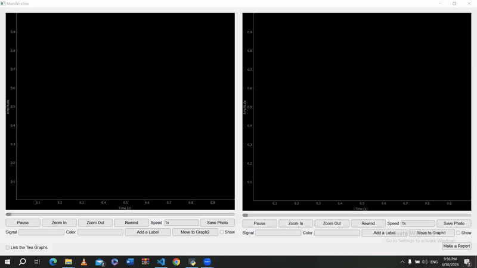

# ICU Monitor

## Overview
Monitoring vital signals is a crucial aspect of any ICU room. This project, **ICU Monitor**, is a desktop application developed using Python and PyQt that provides a multi-port, multi-channel signal viewer. The application allows users to open and view multiple signal files with advanced features for analyzing and manipulating these signals.

## Features
### Signal Viewing
- **Multi-port, Multi-channel Viewer**: The application contains two main identical graphs, each capable of displaying different signals.
- **Independent or Linked Graphs**: Each graph has its own controls but can be linked via a button in the UI to display the same time frames, signal speed, and viewport if zoomed or panned.
- **Cine Mode**: Signals are displayed in a running mode, similar to ICU monitors, with the ability to rewind and start running the signal again from the beginning.
- **Browse Signal Files**: Double-click on the graph where you want to open a signal file. A file browser will open, allowing you to select and load the signal.

### Signal Manipulation
- **Change Color**: Customize the color of each signal.
- **Add Label/Title**: Add a label or title to each signal for better identification.
- **Show/Hide Signals**: Toggle the visibility of each signal.
- **Control Cine Speed**: Customize the speed of the running signals.
- **Zoom In/Out**: Adjust the zoom level for better signal analysis.
- **Pause/Play/Rewind**: Control the playback of the signals with pause, play, and rewind options.
- **Scroll/Pan**: Scroll through signals using sliders or pan using mouse movements.
- **Move Signals**: Transfer signals from one graph to the other.

### Exporting & Reporting
- **Snapshots and Reporting**: Take snapshots of the graphs and generate a report in PDF format.
- **Data Statistics**: Include mean, standard deviation, duration, minimum, and maximum values of the displayed signals in the report.
- **PDF Generation**: The report contains a well-organized layout with tables of data statistics.

## Installation
To install and run the ICU Monitor application, follow these steps:

1. **Clone the Repository**

2. **Install Dependencies**

3. **Run the ICU_monitor.py File**

## Usage
1. **Open Signal Files**: Double-click on the graph where you want to open a signal file. Use the file browser to open signal files on your PC. Each graph can load and display different signals.
2. **Control and Analyze Signals**: Utilize the UI elements to manipulate the signals, including changing colors, adding labels, adjusting cine speed, zooming, pausing, and panning.
3. **Take Snapshots:** Capture snapshots of the graphs by clicking on the snapshot button in the UI. These snapshots are saved in the previous_snapshots folder. Remember to delete unwanted snapshots to avoid wasting memory.
4. **Link Graphs**: Click the link button to synchronize the two graphs for the same time frames and zoom levels.
5. **Export Reports**: Take snapshots and generate PDF reports with data statistics for comprehensive analysis.
## Contributers

<table>
  <tr>
   <td align="center">
      <a href="https://github.com/Nadaaomran">
        
         
        <b>Nada Omran</b>
      </a>
       
    </td>
    <td align="center">
      <a href="https://github.com/hadeerfasih">
        
         
        <b>Hadeer Fasih</b>
      </a>
       
    </td>
   <td align="center">
      <a href="https://github.com/Mariam-Hatem">
        
         
        <b>Mariam Hatem</b>
      </a>
       

  </tr>
</table>
